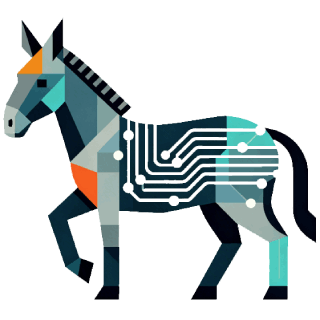
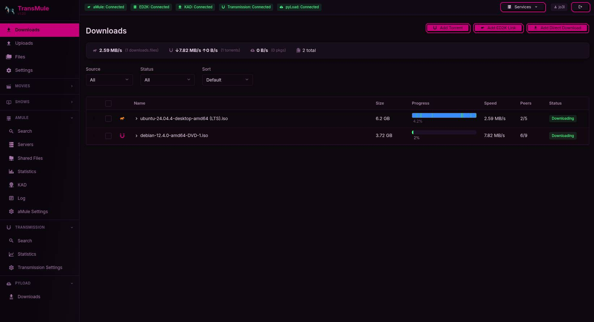

<div align="center">
  
  
<pre>
 ______   ______    ______    __   __    ______    __    __    __  __    __        ______   
/\__  _\ /\  == \  /\  __ \  /\ "-.\ \  /\  ___\  /\ "-./  \  /\ \/\ \  /\ \      /\  ___\  
\/_/\ \/ \ \  __<  \ \  __ \ \ \ \-.  \ \ \___  \ \ \ \-./\ \ \ \ \_\ \ \ \ \____ \ \  __\  
   \ \_\  \ \_\ \_\ \ \_\ \_\ \ \_\\"\_\ \/\_____\ \ \_\ \ \_\ \ \_____\ \ \_____\ \ \_____\
    \/_/   \/_/ /_/  \/_/\/_/  \/_/ \/_/  \/_____/  \/_/  \/_/  \/_____/  \/_____/  \/_____/
</pre>                                                                                                    

  # TransMule — Unified Self-Hosted Download Manager

  <p align="center">
    <strong>One dashboard to manage aMule (ED2K/Kademlia), Transmission (BitTorrent), Slskd (Soulseek) and pyLoad NG (direct downloads)</strong>
  </p>

  <p align="center">
    <a href="https://github.com/Jo3l/transmule/releases"></a>
    <a href="https://github.com/Jo3l/transmule/stargazers"></a>
    <a href="https://github.com/Jo3l/transmule/actions/workflows/docker-publish.yml"></a>
    <a href="https://github.com/Jo3l/transmule/pkgs/container/transmule"></a>
    <a href="https://github.com/Jo3l/transmule/blob/main/LICENSE"></a>
    <a href="https://github.com/Jo3l/transmule/issues"></a>
  </p>

  <p align="center">
    <a href="#-features">Features</a> •
    <a href="#-quick-start">Quick Start</a> •
    <a href="#-screenshots">Screenshots</a> •
    <a href="#-architecture">Architecture</a> •
    <a href="#-plugin-system">Plugins</a> •
    <a href="#-comparison">Comparison</a> •
    <a href="#-environment-variables">Configuration</a> •
    <a href="#-development">Development</a> •
    <a href="#-faq--troubleshooting">FAQ</a>
  </p>

  <p align="center">
    🌐 <strong>English</strong> • Español • Português • Italiano • Deutsch • Polski • Türkçe • Русский • हिन्दी
  </p>

  
  <br><em>TransMule dashboard — unified view of all your downloads</em>
</div>

<br>

---

> **TransMule** is a modern, self-hosted web interface that unifies four download ecosystems — **aMule** (ED2K/Kademlia), **Transmission** (BitTorrent), **Slskd** (Soulseek) and **pyLoad NG** (direct/one-click hosting) — into a single dashboard. Deployed via Docker Compose, it works on any architecture (x86_64 and ARM64) and includes a built-in file manager with remote storage mounts, media preview, archive utilities, extensible plugin system, multi-user auth, and full i18n support. All in one container with a single `docker compose up -d`.

<br>

## Features

### Unified Download Management
| Feature | Description |
|---------|-------------|
| **Unified dashboard** | All downloads — aMule files, BitTorrent transfers, Soulseek downloads and pyLoad packages — in one sortable, filterable table with mobile card layout |
| **aMule integration** | Browse and search the ED2K/Kademlia network, manage downloads, view chunk availability, sources, friends, connected servers, KAD status and full preferences |
| **Transmission integration** | Add torrents via magnet link or URL, control downloads, inspect peers/trackers/files, configure network and speed limits |
| **Slskd integration** | Search the Soulseek network, download files, browse user shares, chat in rooms and private messages, manage transfers |
| **pyLoad NG integration** | Add direct-download (DDL) packages, monitor link extraction status, stop/restart/delete packages with full queue management |
| **Torrent search** | Search multiple torrent indexes directly from the UI with live streaming results — extensible via plugins |

### File Management & Storage
| Feature | Description |
|---------|-------------|
| **Full file manager** | Browse, upload, download, rename, delete, move and copy files through a clean web interface |
| **Remote mounts** | Mount **SMB/CIFS** and **WebDAV** shares and manage remote files transparently as if they were local |
| **Extensible mount system** | Provider-agnostic architecture — adding new protocols (SFTP, NFS, S3, …) only requires implementing a small interface |
| **Archive utilities** | Compress files into zip/tar/tar.gz/tar.bz2/tar.xz (with optional password for zip), extract uploaded archives, smart rename media files |
| **Media preview** | In-browser image viewer, video player with streaming, and text editor for quick inspection |

### Plugin System
| Feature | Description |
|---------|-------------|
| **Runtime plugins** | Upload `.js` plugins without restarting the server — they're active immediately after refresh |
| **Media providers** | Add sidebar browse/search for movies, shows, and more (YTS, DonTorrent, ShowRSS, etc.) |
| **Torrent search sources** | Add custom torrent indexers (PirateBay, YTS Search, Nyaa.si, TorrentClaw, etc.) |
| **Official plugins** | Maintained in [transmule-plugins](https://github.com/Jo3l/transmule-plugins) with a public manifest |

### User Experience
| Feature | Description |
|---------|-------------|
| **Multi-user auth** | JWT-based login with per-user preferences stored in SQLite |
| **Light / Dark themes** | Full theme support that respects system preference |
| **i18n** | English, Español, Português, Italiano, Deutsch, Polski, Türkçe, Русский, हिन्दी — 9 languages |
| **Mobile-friendly** | Responsive layout with card-based view on small screens |
| **Statistics** | Live aMule stats tree + Transmission session statistics |
| **API documentation** | Interactive Swagger docs at [`/_scalar`](http://localhost:3001/_scalar) |

### Webamp — Winamp in the Browser
| Feature | Description |
|---------|-------------|
| **Built-in player** | Embedded [Webamp](https://webamp.org) (Winamp v2 reimplementation) with Milkdrop visualizations via Butterchurn |
| **Audio playback** | Click any audio file in the file manager to play it, or drag & drop files onto the player |
| **Custom skins** | Install `.wsz` skins from [Winamp Skin Museum](https://skins.webamp.org) or any direct URL — supports live skin switching via `setSkinFromUrl()` |
| **Default / custom** | Switch between the built-in Base 2.4 skin or any installed custom skin; uses internal Redux action `LOAD_DEFAULT_SKIN` to reset |
| **Window layout** | Toggle Equalizer, Playlist, and Milkdrop windows independently. Double-size mode supported |
| **Persistence** | All preferences (skin, window state, size) are persisted to `localStorage` across sessions |

### Comic Reader
| Feature | Description |
|---------|-------------|
| **Supported formats** | CBZ, CBR, and PDF — extracted client-side via JSZip, libunrar, and pdf.js |
| **File manager integration** | Double-click any comic file in the file manager to open the reader |
| **View modes** | Single page, double page; swipe navigation (horizontal = page, vertical = toggle header) |
| **State persistence** | Reading position is saved in the URL hash (`#comic={path}|{page}`) via `history.replaceState()`, surviving page refreshes |
| **Header overlay** | Collapsible header with page counter, zoom controls, and page navigation dropdown |

<br>

## Quick Start

### Prerequisites
- **Docker** and **Docker Compose** (v2 or later) installed
- At least one of: aMule with EC enabled, Transmission with RPC enabled, Slskd running, pyLoad NG running

### 1. Clone and configure

```bash
git clone https://github.com/Jo3l/transmule.git
cd transmule
cp .env.example .env
```

Edit `.env` — at minimum set your aMule EC password and a JWT secret:

```env
AMULE_GUI_PASSWORD=your_amule_password
JWT_SECRET=change-this-to-a-long-random-string
PYLOAD_USER=pyload
PYLOAD_PASSWORD=pyload
```

### 2. Start all services

```bash
docker compose up -d
```

This starts five containers:
- **app** — TransMule UI + API (nginx + Nitro, single container via supervisord)
- **amule** — aMule daemon (ED2K/Kademlia)
- **transmission** — BitTorrent client
- **slskd** — Soulseek client
- **pyload** — Direct download manager

### 3. Open the dashboard

| URL | What you get |
|-----|--------------|
| [http://localhost:3001](http://localhost:3001) | TransMule dashboard |
| [http://localhost:3001/_scalar](http://localhost:3001/_scalar) | Interactive API docs |

On first run you will be prompted to create an admin account.

### ARM64 / Raspberry Pi

The `docker-compose.yml` is fully ARM64-compatible. The TransMule image is published as a **multi-arch manifest** supporting both `linux/amd64` and `linux/arm64`. All service images are also multi-arch — no special configuration needed.

If you need to pin specific tags:

```env
TRANSMULE_APP_IMAGE=ghcr.io/jo3l/transmule:latest
AMULE_IMAGE=ngosang/amule:latest
TRANSMISSION_IMAGE=lscr.io/linuxserver/transmission:latest
SLSKD_IMAGE=slskd/slskd:latest
PYLOAD_IMAGE=lscr.io/linuxserver/pyload-ng:latest
```

<br>

## Architecture

```
Browser
  │
  └─ transmule-app (port 3001)
        │  nginx — serves Nuxt SPA (static files)
        │        — proxies /api/* and /_scalar → 127.0.0.1:3000
        │
        └─ Nitro API (127.0.0.1:3000, loopback only)
              ├─ JWT auth + user management (SQLite via better-sqlite3)
              ├─ CORS handling
              ├─► aMule EC protocol      (internal :4712)
              ├─► Transmission RPC       (internal :9091)
              ├─► Slskd Web UI + API     (internal :5030)
              └─► pyLoad NG API          (internal :8000)
```

The frontend (Nuxt 3 SPA) and the Nitro API share a single container managed by supervisord. nginx handles static file serving and proxies API traffic to Nitro on the loopback interface — no IP address is ever baked into the image.
**All inter-service communication** happens on an internal Docker network. aMule EC, Transmission RPC, Slskd API and pyLoad API are never exposed to the host. The Nitro API listens on `127.0.0.1:3000` inside the app container exclusively.

<br>

## Plugin System

TransMule has a **runtime plugin system** in JavaScript. Upload a `.js` file via **Settings → Providers** and it's active immediately after page reload — no server restart needed.

### Plugin types

| Type | Purpose | Examples |
|------|---------|----------|
| **Media** (`mediaType`) | Sidebar browse/search for content types (movies, shows, anime) | YTS, DonTorrent, ShowRSS, TorrentClaw Popular |
| **Torrent Search** (`pluginType: \"torrent-search\"`) | Custom index source for the torrent search page | PirateBay, YTS Search, Nyaa.si, TorrentClaw |

### Official plugins

| Plugin | Type | Description |
|--------|------|-------------|
| `yts` | movies | Movie browse/search via YTS.mx with quality & genre filters |
| `dontorrent-movies` | movies | Spanish movie torrents from dontorrent.link |
| `dontorrent-shows` | shows | Spanish series torrents from dontorrent.link |
| `showrss` | shows | TV show torrents from your personal ShowRSS RSS feed |
| `torrentclaw-popular` | movies / shows | Popular torrents from TorrentClaw with metadata |
| `nyaa` | torrent-search | Anime & manga torrents via nyaa.si |
| `piratebay` | torrent-search | General torrents via apibay.org JSON API |
| `yts-search` | torrent-search | Movie torrents via YTS.mx JSON API |
| `torrentclaw` | torrent-search | Torrent search via TorrentClaw API with quality scores |

> Download from [github.com/Jo3l/transmule-plugins](https://github.com/Jo3l/transmule-plugins)

<br>

## Environment Variables

| Variable | Default | Description |
|----------|---------|-------------|
| `PUID` / `PGID` | `1000` | Host user/group IDs for file permissions |
| `TZ` | `Europe/Madrid` | Timezone |
| `DOWNLOAD_DIR` | `./downloads` | Completed downloads host path |
| `INCOMPLETE_DIR` | `./incomplete` | In-progress downloads host path |
| `DATA_DIR` | `./data` | Middleware SQLite database directory |
| `AMULE_GUI_PASSWORD` | — | aMule EC protocol password (port 4712) |
| `TRANSMISSION_USER` / `TRANSMISSION_PASS` | _(empty)_ | Transmission RPC credentials |
| `JWT_SECRET` | `change-me` | Secret for signing JWT tokens (auto-generated if empty) |
| `SLSKD_USERNAME` / `SLSKD_PASSWORD` | — | Soulseek credentials (configured via UI — optional in .env) |
| `PYLOAD_USER` / `PYLOAD_PASSWORD` | `pyload` | pyLoad NG credentials |
| `TRANSMULE_APP_IMAGE` | `ghcr.io/jo3l/transmule:latest` | Optional app image override |
| `AMULE_IMAGE` | `ngosang/amule:latest` | Optional aMule image override |
| `TRANSMISSION_IMAGE` | `lscr.io/linuxserver/transmission:latest` | Optional Transmission image override |
| `SLSKD_IMAGE` | `slskd/slskd:latest` | Optional Slskd image override |
| `PYLOAD_IMAGE` | `lscr.io/linuxserver/pyload-ng:latest` | Optional pyLoad image override |
| `TMDB_API_KEY` | — | TMDB API key for cover artwork |
| `TVDB_API_KEY` | — | TVDB API key for cover artwork (fallback) |

<br>

## Development

### Requirements
- Node.js 20+
- Docker (for back-end services: aMule, Transmission, pyLoad)

### Setup

```bash
# Start back-end services only
docker compose -f docker-compose.dev.yml up -d

# Middleware (hot-reload)
cd middleware && npm install && npm run dev

# Frontend (hot-reload)
cd frontend && npm install && npm run dev
```

Or use the convenience script at the root:

```bash
./dev.sh
```

### Building the Docker image

```bash
docker build -t transmule:dev .
```
<br>

## FAQ & Troubleshooting

### "Can't connect to aMule"
- Verify EC is enabled in aMule: Preferences → Remote Controls → External Connections
- Check the EC password matches `AMULE_GUI_PASSWORD` in `.env`
- Ensure the aMule container is running: `docker compose ps`

### "Can't connect to Transmission"
- Verify RPC is accessible: `curl http://host:9091/transmission/rpc` (a `409` response means RPC is working)
- If RPC auth is enabled, set `TRANSMISSION_USER` and `TRANSMISSION_PASS` in `.env`

### "Can't connect to pyLoad"
- Verify the pyLoad container is running
- Default credentials are `pyload` / `pyload` — configure via `PYLOAD_USER` / `PYLOAD_PASSWORD`

### "Port 3001 is already in use"
- Change the host port in `docker-compose.yml` under `app.ports` (e.g. `"4000:3001"`)

### "File permission errors"
- Ensure `PUID` and `PGID` in `.env` match your host user's IDs
- Run `id` on the host to check: `id -u` (UID), `id -g` (GID)

### "How do I add a torrent?"
- Go to **Transmission → Torrent Search** in the sidebar
- Search, select results, and click the download button — the torrent is sent directly to Transmission

### "How do I update TransMule?"
```bash
docker compose pull app
docker compose up -d app
```

### "Where are my downloads stored?"
- Completed downloads → `./downloads/` (on the host)
- In-progress downloads → `./incomplete/` (on the host)
- These paths are configurable via `DOWNLOAD_DIR` and `INCOMPLETE_DIR` in `.env`

### "Can I access the API directly?"
Yes! The Nitro API is proxied through nginx at `http://localhost:3001/api/...`. Interactive documentation is available at [`http://localhost:3001/_scalar`](http://localhost:3001/_scalar).

<br>

## Contributing

Contributions are welcome! Here's how you can help:

- **Report bugs** — open a [GitHub Issue](https://github.com/Jo3l/transmule/issues)
- **Submit plugins** — add your plugin to [transmule-plugins](https://github.com/Jo3l/transmule-plugins)
- **Translate** — help add more languages via the i18n framework
- **Feature requests** — open a discussion or issue
- **Code** — PRs are always welcome

> This is an AI-assisted project: parts of the code and documentation were developed with AI tooling and reviewed by the maintainer.

<br>

## License

[GNU General Public License v3.0](LICENSE) — see the [LICENSE](LICENSE) file for details.

<br>

---

<div align="center">
  <a href="https://github.com/Jo3l/transmule">GitHub</a> •
  <a href="http://localhost:3001/_scalar">API Docs</a> •
  <a href="https://github.com/Jo3l/transmule-plugins">Plugins</a> •
  <a href="https://github.com/Jo3l/transmule/issues">Issues</a>

  <br><br>
  <sub>Built with ❤️ by <a href="https://github.com/Jo3l">Jo3l</a></sub>
</div>
